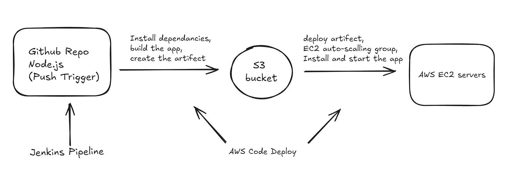

###------------ Shell scripting task is uploaded in the same repo in this file /shell-script-task.sh--------------- 
# Node.Js application deployment on AWS 
## Tool Used 
- Jenkins
- AWS Codedeploy
- AWS EC2
- GitHub

This Guide will walk you through step bu step process of creating a jenkins file to deploying the application on AWS EC2.

## Setup Steps

Clone this repo in you local. 

Create an AWS

### 1. Clone the repository

```
git clone https://github.com/NaitikSinghal/k8s-deployment
```
